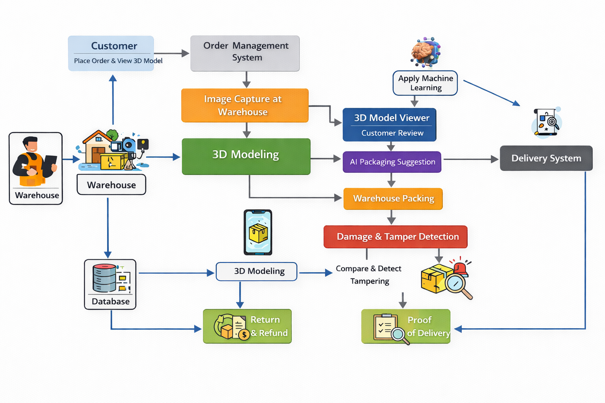

# Delivery Verification System

## Project Overview
The 3D Modeling–Based Delivery Verification System is a technology-driven solution designed to improve transparency, trust, and dispute handling in e-commerce and logistics. Unlike traditional delivery systems, this project focuses only on 3D modeling and computer vision.

The system generates a 3D model of an item from multiple images before delivery, allowing customers to visually verify the item condition before accepting the order. Once accepted, the system provides AI-based packaging suggestions to the warehouse. During delivery, the system performs damage and tamper detection by comparing package conditions. Finally, it generates a proof of delivery, enabling instant refunds in case of damage.

## System Architecture Diagram

  

## Project Objectives
- Generate accurate 3D models from item images
- Allow customers to verify items before delivery
- Provide AI-based packaging suggestions to warehouses
- Detect damage or tampering during delivery
- Enable instant return and refund processing
- Generate proof of delivery for completed orders

## System Workflow
1. The customer places an order for the item through the system.
2. Item images are captured at the warehouse after the order is placed.
3. A 3D model of the item is generated using the captured images.
4. The generated 3D model is presented to the customer for inspection.
5. The customer reviews the 3D model and accepts the order.
6. After order acceptance, the warehouse requests an AI-based packaging suggestion.
7. The system provides suitable packaging recommendations based on the item’s 3D model.
8. The warehouse packs the item using the suggested packaging materials.
9. The packaged item is sent for delivery.
10. During delivery, the system performs damage and tamper detection.
11. If damage is detected, the item can be returned and a refund is processed instantly.
12. If no damage is detected, proof of delivery is generated and stored.

##System Functions

### 3D Modeling & Customer Verification

This module is responsible for generating a 3D representation of the ordered item and allowing the customer to verify it before delivery.

#### Key Features
- Captures multiple images of the item from different angles at the warehouse
- Reconstructs a 3D model using 3D reconstruction techniques
- Stores item shape, size, and surface condition data
- Allows the customer to rotate, zoom, and inspect the 3D model
- Enables the customer to accept the order before the delivery process begins

#### Technologies Used
- **Open3D** – 3D reconstruction and point cloud processing  
- **NeRF Studio** – Neural Radiance Field–based 3D model generation  
- **Google Colab** – Development and model training environment

### AI-Based Packaging Suggestion

This module provides intelligent packaging recommendations to the warehouse after the customer accepts the order. The goal is to reduce delivery damage, minimize packaging costs, and eliminate manual decision-making errors.

#### Key Features
- Collects order and delivery-related information
- Analyzes package weight, product type, delivery distance, transport mode, and packaging material cost
- Learns patterns from historical packaging and delivery data
- Predicts the most suitable packaging material for each order
- Reduces manual packaging decisions and operational errors
- Provides packaging recommendations before item dispatch

#### Input Parameters Analyzed
- Package weight
- Product type (fragile, non-fragile, etc.)
- Delivery distance
- Transport mode (bike, van, truck, etc.)
- Packaging material cost

#### Packaging Suggestions Provided
- Most suitable packaging material
- Optimal packaging type that balances protection and cost efficiency
- Packaging option that minimizes product damage during delivery

#### Technologies Used
- **Python** – Machine learning model development  
- **XGBoost** – Supervised machine learning algorithm for prediction  
- **Scikit-learn** – Data preprocessing, feature engineering, and model evaluation  
- **Google Colab** – Model training and experimentation environment  
- **Flask** – REST API for delivering packaging recommendations to the warehouse system

